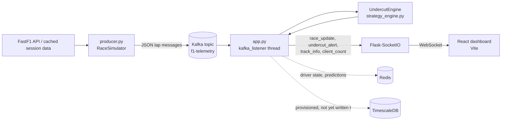

# Architecture

## System overview

## Components

**FastF1 data source** — Historical F1 session data (laps, tyres, weather, track status), pulled from F1's live-timing API and cached to disk as `.ff1pkl` files so repeat runs don't re-fetch.

**`backend/producer.py` (`RaceSimulator`)** — Loads a FastF1 session, replays its laps in order with a configurable delay to simulate real-time pacing, and publishes each lap as a JSON message to the Kafka `f1-telemetry` topic.

**Kafka (`f1-telemetry` topic)** — Single-broker Kafka (Zookeeper + Kafka, via Confluent images) decouples the producer from the backend; the backend consumes from `localhost:9092` (or `kafka:29092` inside Docker).

**`backend/app.py` (`kafka_listener`)** — A background thread runs a `KafkaConsumer` loop, updates the strategy engine's per-driver state on each message, detects lap rollovers, schedules undercut checks, and broadcasts updates over Socket.IO.

**`backend/strategy_engine.py` (`UndercutEngine`)** — Tracks per-driver state (lap times, tyre age/compound, stint, weather, track status) and computes undercut viability: projects both drivers' pace forward accounting for tyre degradation and weather, compares it against pit-stop loss and fresh-tyre advantage, and returns a `{viable, time_delta, confidence, ...}` recommendation.

**Flask + Flask-SocketIO** — Exposes REST endpoints for polling (`/api/status`, `/api/drivers`, etc.) and pushes real-time events (`race_update`, `undercut_alert`, `track_info`, `client_count`) to all connected WebSocket clients.

**Redis** — Used as a live cache: current driver state (`f1:driver:<name>`) and recent prediction results (`f1:prediction:...`, `f1:predictions:recent`), each with a 1-hour TTL. Not used for historical/durable storage.

**TimescaleDB** — Provisioned in both `docker-compose.yml` and `docker-compose.prod.yml` (with a healthcheck) as the intended long-term time-series store for lap/telemetry history. Honesty note: the backend does not currently write to it — no hypertables or persistence layer exist yet. It's infrastructure-ready but not wired into `app.py`. Listed here as a known gap, not a hidden feature.

**React dashboard (Vite)** — Connects via `socket.io-client`, renders live standings, a per-driver lap-time chart, an undercut alert feed, and driver/circuit detail panels. Served in production by Nginx (`frontend/nginx.conf`), which also reverse-proxies `/api/*` and `/socket.io/*` to the Flask backend container.

## Data contracts

### `race_update` (emitted on every processed lap message)

| Field | Type | Description |
|---|---|---|
| `timestamp` | string (ISO 8601) | Server time the update was emitted |
| `driver` | string | Driver code (e.g. `VER`) |
| `lap_number` | int | Lap number for this update |
| `lap_time` | string/float | Raw lap time from FastF1 |
| `compound` | string | Tyre compound (`SOFT`/`MEDIUM`/`HARD`) |
| `tyre_life` | int | Laps on current tyre set |
| `position` | int | Track position |
| `current_pace` | float | Rolling average of the driver's last 3 lap times (seconds) |

### `undercut_alert` (emitted when `UndercutEngine.predict_undercut_window` returns `viable: true`)

| Field | Type | Description |
|---|---|---|
| `timestamp` | string (ISO 8601) | Server time the alert was emitted |
| `ahead` | string | Driver code currently ahead (the undercut target) |
| `behind` | string | Driver code currently behind (who should pit) |
| `current_gap` | float | Current time gap between the two drivers (s) |
| `laps_to_overcome` | float/string | Laps needed to close the gap post-pit, or `"N/A"` |
| `time_delta` | float | Projected per-lap time gain from undercutting (s) |
| `confidence` | float | 0.0–1.0, based on how much lap history is available |
| `recommendation` | string | `"BOX NOW"` or `"STAY OUT"` |
| `pit_loss` | float | Estimated pit-stop time loss for current track/conditions |
| `ahead_projected` / `behind_projected` | float | Projected next-lap pace for each driver |
| `ahead_compound` / `behind_compound` | string | Tyre compounds |
| `compound_advantage` | float | Pace delta from compound difference alone |
| `weather_condition` | string | `dry`/`hot`/`cool`/`rain` |
| `track_status` | string | `GREEN`/`YELLOW`/`SAFETY_CAR`/`RED`/`VSC Deployed` |
| `reason` | string | Human-readable explanation |

Other emitted events: `track_info` (`{track, config}`, sent once the session name is known), `connection_response` (sent to a client on connect), `client_count` (`{count}`, broadcast on connect/disconnect).
