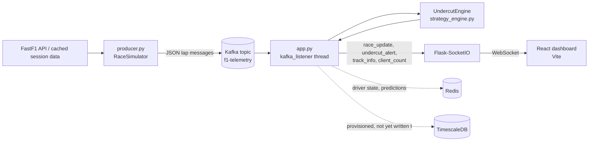

# F1 Undercut Strategy Engine


Real-time F1 race strategy predictions: a Kafka pipeline streams lap-by-lap telemetry from historical race sessions into a tyre-degradation model that flags viable undercut pit-stop windows, pushed live to a WebSocket dashboard as the race unfolds.

## Demo


*Live demo was deployed on a temporary GCP VM for testing and has since been taken down (see [DEPLOYMENT.md](DEPLOYMENT.md)).*

## Overview

This project replays historical F1 race sessions (via [FastF1](https://docs.fastf1.dev/)) through a Kafka pipeline, feeds each lap into a strategy engine that models tyre degradation and track position, and streams undercut pit-stop recommendations to a live React dashboard in real time.

## Features

- Real-time lap-by-lap telemetry streaming through Apache Kafka
- Undercut viability predictions accounting for tyre degradation, compound differences, weather, and safety car conditions
- Live dashboard: standings, per-driver lap-time chart, undercut alert feed, driver detail panel, circuit map
- REST API for polling driver state, track config, gaps, and predictions history
- Dockerized backend + frontend with separate dev and production Compose stacks
- CI on every push/PR: backend pytest + ruff, frontend eslint


## Architecture



Full diagram and data contracts: [ARCHITECTURE.md](ARCHITECTURE.md)

## Tech stack

`Python` `Apache Kafka` `Flask` `Flask-SocketIO` `React (Vite)` `Docker` `Redis` `TimescaleDB` `Nginx` `GitHub Actions`

## How it works

1. `producer.py` loads a cached FastF1 race session and replays its laps in order, publishing each as a JSON message to Kafka.
2. `app.py` consumes the stream in a background thread, updates per-driver state in `UndercutEngine`, and checks for undercut opportunities after each lap rollover.
3. `UndercutEngine` projects both drivers' pace forward (tyre degradation + weather), compares it against pit-stop loss and fresh-tyre advantage, and returns a viability verdict.
4. Results are broadcast over Socket.IO (`race_update`, `undercut_alert`) and rendered live in the React dashboard.

See [API.md](API.md) for the full REST/WebSocket reference.

## Local development

```bash
# Infra (Kafka, Zookeeper, Redis, TimescaleDB)
docker-compose up -d
docker exec kafka kafka-topics --create --topic f1-telemetry --bootstrap-server localhost:9092 --if-not-exists

# Backend
python3 -m venv venv
source venv/bin/activate
pip install -r requirements.txt
cd backend
python app.py

# Frontend (separate terminal)
cd frontend
npm install
npm run dev

# Producer (separate terminal, from backend/)
python producer.py
```

Dashboard: `http://localhost:5173` (Vite dev server). Backend: `http://localhost:5000`.

## Deployment

Full instructions, including the GCP trial-credit demo path and a known FastF1/cloud-IP limitation and its workaround: [DEPLOYMENT.md](DEPLOYMENT.md)

Long-term goal is a $0 deployment on Oracle Cloud's Always Free Ampere tier; the GCP path documented here was a temporary stand-in due to Oracle capacity limits at the time.

## CI

Every push and PR runs backend tests (`pytest`), lint (`ruff`), and frontend lint (`eslint`) via [GitHub Actions](.github/workflows/ci.yml).

## Future improvements

- Persist lap/telemetry history to TimescaleDB (currently provisioned but unused — see [ARCHITECTURE.md](ARCHITECTURE.md))
- Multi-session support (switch races without restarting the backend)
- Historical accuracy backtesting across more sessions to tune degradation constants
- Authenticated multi-user dashboard sessions
- Retry/queue FastF1 fetches through a non-cloud egress path to avoid the CDN-blocking workaround


## License

MIT

## Contact

Karan Gupta — [karangu1022@gmail.com](mailto:karangu1022@gmail.com)
